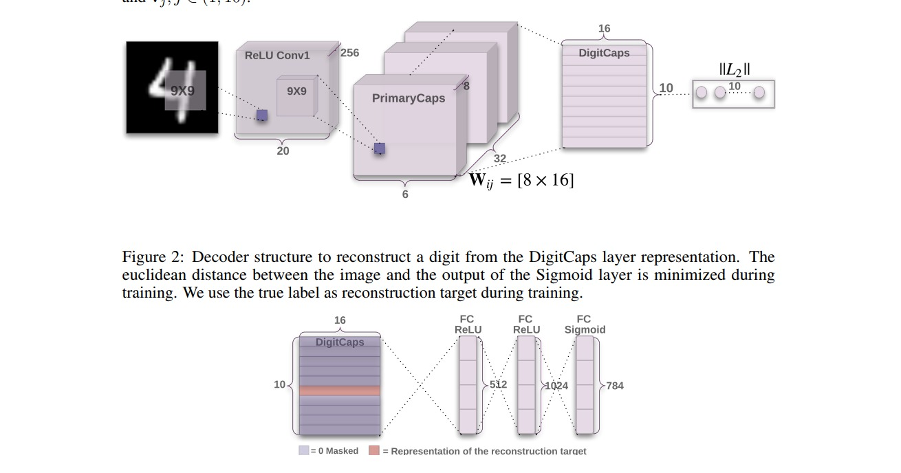
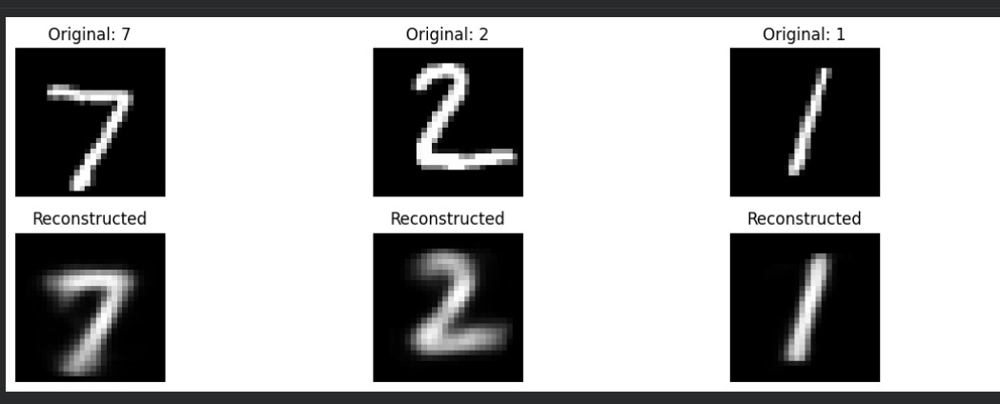

# Capsule Network (CapsNet) Implementation in PyTorch

Implementation of **Capsule Networks (CapsNet)** based on the paper:

> **Dynamic Routing Between Capsules**
> Sara Sabour, Nicholas Frosst, Geoffrey Hinton
> https://arxiv.org/abs/1710.09829

This repository contains two different CapsNet implementations:

1. **Original Paper Implementation**
   Reproduction of the architecture proposed in the original paper.

2. **Improved Decoder Version**
   Modified reconstruction decoder focused on improving reconstruction quality and training behavior.

---

# Overview

Traditional Convolutional Neural Networks (CNNs) detect features effectively, but they struggle to preserve spatial hierarchies and pose relationships between object parts.

Capsule Networks were proposed by Geoffrey Hinton to address this limitation using:

* Vector-based neurons called **capsules**
* Dynamic routing between layers
* Pose-aware feature representations
* Reconstruction regularization

Unlike scalar activations in CNNs, capsules output vectors where:

* **Vector length** → probability of object existence
* **Vector orientation** → spatial properties such as pose, orientation, thickness, skew, etc.

---

# Architecture

## Original CapsNet Architecture

```text
Input Image (28x28)
        │
        ▼
Conv Layer
256 Filters, 9x9 Kernel
        │
        ▼
Primary Capsules
32 Capsule Channels
8D Capsules
        │
        ▼
Digit Capsules
10 Capsules
16D Capsules
Dynamic Routing
        │
        ├────────────► Classification Output
        │
        ▼
Masking
(True Label / Predicted Label)
        │
        ▼
Decoder Network
FC → FC → FC
        │
        ▼
Reconstructed Image (28x28)
```

---

# Architecture Visualization

<p align="center">
  
</p>


# Reconstruction Results

The decoder network reconstructs the input image from the capsule representations.

This acts as:

* A regularizer
* A representation learning constraint
* A visualization tool for understanding learned features

<p align="center">
  
</p>


# Training Results

| Metric        | Value                             |
| ------------- | --------------------------------- |
| Dataset       | MNIST                             |
| Best Accuracy | **99.26%**                        |
| Parameters    | **20,673,040**                    |
| Framework     | PyTorch                           |
| Device        | CUDA / GPU                        |
| Loss Function | Margin Loss + Reconstruction Loss |

---


# Two Implementations

## 1. Original Paper Implementation

This version closely follows the architecture described in the original paper.

Features:

* Dynamic routing
* Margin loss
* Reconstruction decoder
* Capsule masking
* Paper-consistent structure

Goal:

* Faithful reproduction of the original CapsNet paper

---

## 2. Improved Decoder Version

This version experiments with a modified decoder architecture.

Focus Areas:

* Better reconstruction quality
* Faster convergence
* Improved decoder expressiveness
* More stable training

Changes include:

* Decoder redesign
* Reconstruction optimization
* Training experimentation

---

# Dynamic Routing

One of the core innovations of CapsNet is **routing-by-agreement**.

Instead of max pooling, capsules route information based on agreement between lower-level and higher-level capsule predictions.

This allows:

* Better spatial understanding
* Reduced information loss
* Hierarchical feature learning

---

# Loss Function

The model uses two losses:

## 1. Margin Loss

Used for classification.

The goal is:

* Correct class capsule → large vector length
* Incorrect class capsules → small vector lengths

---

## 2. Reconstruction Loss

The decoder reconstructs the input image from the capsule outputs.

This forces the network to preserve detailed information about the object.

Total Loss:

```math
Total Loss = Margin Loss + λ × Reconstruction Loss
```

---

# Hugging Face Model

Model available on Hugging Face:

https://huggingface.co/tdizhere/capsnet1

---

# Key Learnings From This Project

This project helped explore:

* Advanced PyTorch tensor operations
* Dynamic routing algorithms
* Representation learning
* Decoder-based regularization
* Research paper implementation
* Training stability challenges
* Capsule-based architectures

---

# Limitations of CapsNet

Although CapsNet is conceptually powerful, it has practical limitations:

* Computationally expensive
* Slow routing process
* Difficult to scale to large datasets
* Large parameter count
* Higher memory usage compared to CNNs

These limitations are one reason why CapsNet is less commonly used in production systems today.

---

# References

## Original Paper

Sabour, Sara, Nicholas Frosst, and Geoffrey Hinton.
"Dynamic Routing Between Capsules."
https://arxiv.org/abs/1710.09829

---

## Capsule Network Explanation

Understanding Hinton’s Capsule Networks (Part II):
https://medium.com/ai³-theory-practice-business/understanding-hintons-capsule-networks-part-ii-how-capsules-work-153b6ade9f66

---

# Acknowledgements

* Geoffrey Hinton
* Sara Sabour
* Nicholas Frosst
* PyTorch Community

---

# Future Improvements

Planned experiments:

* Faster routing algorithms
* Better reconstruction decoders
* EM Routing
* CIFAR-10 implementation
* Capsule Vision Transformers
* Mixed precision training
* Efficient capsule layers

---

# License

MIT License
